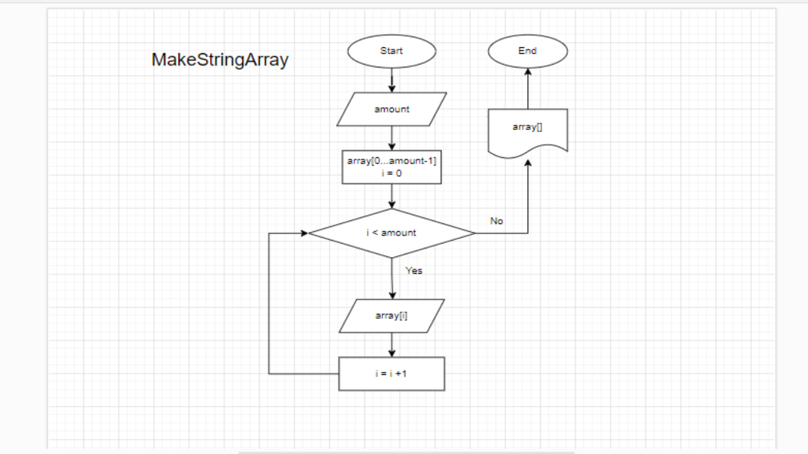
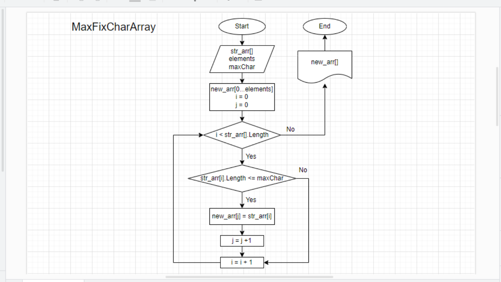
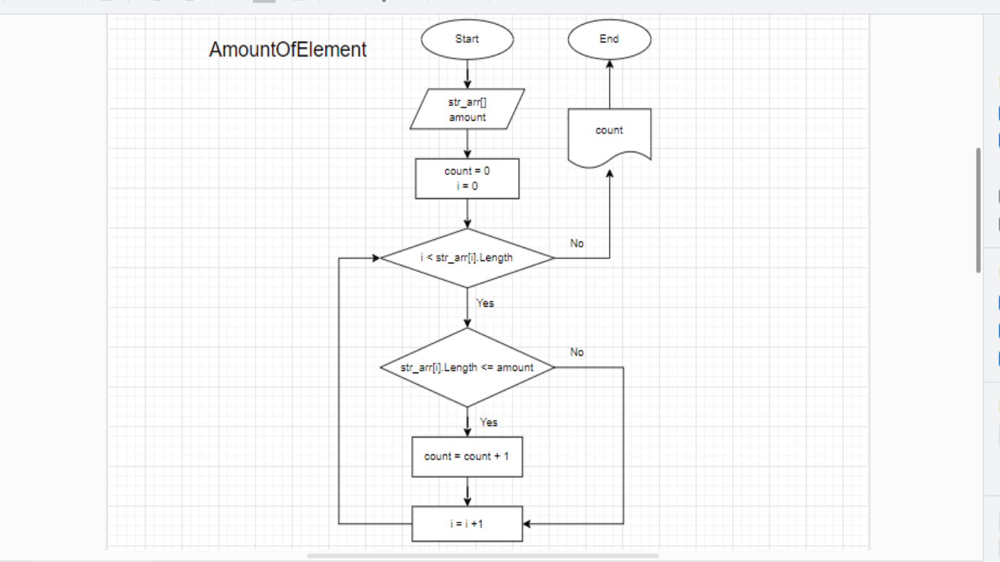
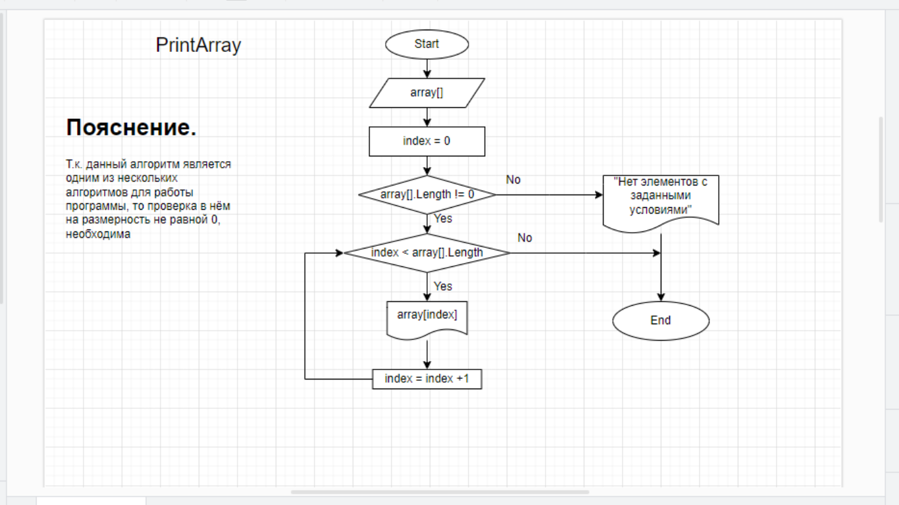

# *Задача:*
### Написать программу, которая из имеющегося массива строк формирует новый массив из строк, длина которых меньше, либо равна 3 символам.

### При решении не рекомендуется пользоваться коллекциями, лучше обойтись исключительно массивами.

> ***PS.*** В данном решении, string массив, полностью задаётся пользователем. 
>> **Т.е.** колличество элементов массива, каждый элемент массива и ограничение по длине строк нового массива, пользователь **вводит сам** .

## 1. Создание _string_ массива.

### MakeStringArray().
В данный метод пользователь передаёт колличество элементов строкового массива.
Внутри метода создаётся *string* массив на переданное колличество элементов. Далее пользователь заполняет каждый элемент созданного массива.

### MaxFixCharArray().
Метод создаёт массив из другого массива с ограниченными по длине элементами.
В данный метод передаётся *string* массив, кол-во элементов с учётом ограничения, а также переменная по колличеству символов в каждом элементе.
В цикле проверяем каждый элемент переданного массива на соответствие условию и при выполнении условия записываем элемент в новый массив.

## 2. Математика задачи.

### AmountOfElements().
Метод подсчитывает колличество элементов в массиве с заданным ограничением по размеру.
В метод передаётся _string_ массив и переменная с размером ограничения по длинне элемента.

## 3. Вывод (печать) результата.

### PrintArray().
Данный метод выводит (печатает) *string* массив.
На вход методу подаётся строчный массив, а он его выводит (печатает).

